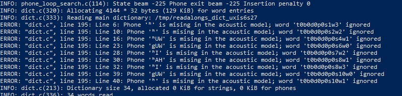

!!! note
    This troubleshooting guide is under construction.

# Troubleshooting

This document in intended to list common errors your may encounter when trying to
run ReadAlongs, and ways to debug them.

It only ever got one contribution, but more can get added here as needed.

## Phones missing in the acoustic model

!!! note
    Troubleshooting item under construction

You may get an error that looks like this:

The general structure of your error would look like
`Phone [character] is missing in the acoustic model; word [index] ignored`
This error is most likely caused not by a bug in your ReadAlong input
files, but by an error in one of your g2p mappings. The error message is
saying that there is a character in your ReadAlong text that is not
being properly converted to English-arpabet (eng-arpabet), which is the
language ReadAlong uses to map text to sound. Thus, ReadAlong cannot
match your text to a corresponding sound (phone) in your audio file
because it cannot understand what sound the text is meant to represent.
Follow these steps to debug the issue **in g2p**.

1. Identify which characters in each line of the error message are
**not** being converted to eng-arpabet. These will either be:

    1. characters that are not in caps (for example `g` in the string
       `gUW` in the error message shown above.)

    2. a character not traditionally used in English (for example `é` or `Ŧ`,
       or `ʰ` in the error message shown above.) You can confirm you
       have isolated the right characters by ensuring every other
       character in your error message appears as an **output** in the
       [eng-ipa-to-arpabet
       mapping](https://github.com/roedoejet/g2p/blob/main/g2p/mappings/langs/eng/eng_ipa_to_arpabet.json).
       These are the problematic characters we need to debug in the error
       message shown above: `g` and `ʰ`.

2. Once you have isolated the characters that are not being converted to
   eng-arpabet, you are ready to begin debugging the issue. Start at
   step 3 below for each problematic character.

3. Our next step is to identify which mapping is converting the
   problematic characters incorrectly. Most of the time, the issue will
   be in either the first or the second of the following mappings:

    1. *xyz-ipa* (where xyz is the ISO language code for your mapping)
    2. *xyz-equiv* (if you have one)
    3. *xyz-ipa_to_eng-ipa* (this mapping must be generated
       automatically in g2p. Refer //here_in_the_guide to see how to do
       this.)
    4. [eng-ipa-to-arpabet
       mapping](https://github.com/roedoejet/g2p/blob/main/g2p/mappings/langs/eng/eng_ipa_to_arpabet.json)
       (The issue is rarely found here, but it doesn’t hurt to check.)

4. Find a word in your text that uses the problematic character. For the
   sake of example, let us assume the character I am debugging is `g`,
   that appears in the word "dog", in language "xyz".

5. Make sure you are in the g2p repository and run the word through
   `g2p convert` to confirm you have isolated the correct characters
   to debug: `g2p convert dog xyz eng-arpabet`. Best practice is to
   copy+paste the word directly from your text instead of retyping it.
   Make sure to use the ISO code for your language in place of "xyz".
   *If the word converts cleanly into eng-arpabet characters, your issue
   does not lie in your mapping. //Refer to other potential RA issues*

6. From the result of the command run in 5, note the characters that do
   **not** appear as **inputs** in the [eng-ipa-to-arpabet
   mapping](https://github.com/roedoejet/g2p/blob/main/g2p/mappings/langs/eng/eng_ipa_to_arpabet.json).
   These are the characters that have not been converted into characters
   that eng-ipa-to-arpabet can read. These should be the same characters
   you identified in step 2.

7. Run `g2p convert dog xyz xyz-ipa`. Ensure the result is what you
   expect. If not, your error may arise from a problem in this mapping.
   refer_to_g2p_troubleshooting. If the result is what you expect,
   continue to the next step.

8. Note the result from running the command in 7. Check that the
   characters \[TODO-fix this text\] (appear/being mapped by generated --
   use debugger or just look at mapping)
